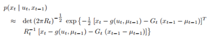

# Introduction

### Definition
- Extended Kalman Filter (EKF) has the same process with Kalman Filter (KF) with only an alteration in the assumption.
- Instead of assuming that the system is linear, EKF tries to construct a linear approximation from it.
  - Assume the system can be expressed in non-linear functions:
    - 
  - We can do linear approximation as:
    - 
    - 
  - Then, 
    - The approximation for state transition probability will be:
      - 
    - The approximation for measurement probability will be:
      - 

### Pseudocode algorithm
Pseudocode algorithm will be:

_Sebastian Thrun, Wolfram Burgard, and Dieter Fox. Probabilistic robotics. MIT press, 2005. Page 51_

### Derivation
- TOWRITE

# Experiments
Requirement description: <a href="http://stefanosnikolaidis.net/course-files/CS545-Fall2020/Slides_7.pdf">USC - CSCI54 5- Fall 2020 - Lecture 7</a> by <a href="http://www.stefanosnikolaidis.net/"> Prof. Stefanos Nikolaidis </a>

### Problem
In this situation, we want to estimate the position of a flying airplane given the radar data.
Consider the following situation:
 - The plane flies with a constant velocity v: vt = vt-1
 - The plane flies in a constant height h: ht = ht-1
 - The position of the plane is scaled in one dimension: pt = pt-1 + vt*Δt
 - The range from the radar to the plane is
   -  
 - But due to the error in the measurement, our detected range data will be
   -  
   - where 𝛿 is a Gaussian noise

We want to estimate the position of the airplane w.r.t our range data

### Solution
- State transition model:
  - We consider the state **x**t to be:
    - **x**t = [pt vt ht]T
  - Here, we only consider a simple case, where state is in a linear form and using no control data.
  - Then,
    -  
  - Or,
    - 
- Measurement model:
  - We consider zt = rt
    -  
  - Then,
    - 
  - Hear h(**x**t) is not linear. Therefore, we do linear approximation for h() as:
    - 
  - Where 
    - 
- With above models, we can apply EKF to estimate the position of the airplane
  
### Result
- TOWRITE