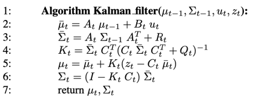
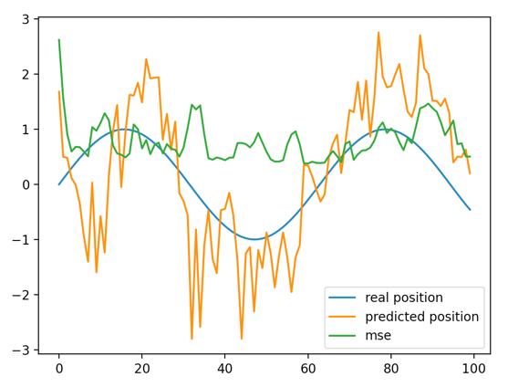

# Introduction

### Definition
Kalman Filter is a variant of Bayes Filter which is built to calculate a belief distribution of state of system, given measurement data and control data. 
- Formally, we want to calculate bel(**x**t) = p(**x**t| **z**1:t, **u**1:t)
  - Where:
    - **x**t is the state at current time
    - **z**1:t is the sequence of historical data from sensors, called measurement data
    - **u**1:t is the sequence of historical data from actuators, called control data

In Kalman Filter, we try to find a loop to calculate the above probability by using Multivariate Gaussian distribution and Linear expression to represent state transitional probability and measurement probability.

To use the Kalman Filter, we define some assumption:
- The system follows Markov Assumption
- The system must be linear
    1) Transitional probability p(**x**t| **u**t, **x**t-1) must be applied to a state xt that can be represented as a linear function of **u**t and **x**t-1, plus a Gaussian noise:
       - **x**t = **A**t **x**t-1 + **B**t **u**t + **e**t
         - Where:
           - **x**t is a vector represent state, shape = (n, 1). 
           - **u**t is a vector represent control data, shape = (m, 1)
           - **A**t is a matrix, shape = (n, n)
           - **B**t is a matrix, shape = (m, m)
           - **e**t is a Gaussian noise that is a multivariate Gaussian random vector with mean = 0 and covariance = **R**t
       - Then,
         -  
           
    2) Measurement probability p(**z**t| **x**t) can be represented as a linear function of **x**t, plus a Gaussian noise: 
       - **z**t = **C**t **x**t + **d**t 
         - Where:
           - **z**t is a vector represent measurement data, shape = (k, 1). 
           - **x**t is a vector represent state, shape = (n, 1). 
           - **C**t is a matrix, shape = (k, n)
           - **d**t is a Gaussian noise that is a multivariate Gaussian random vector with mean = 0 and covariance = **Q**t
       - Then,
         -  
           
    3) Belief of state at sthe initial timestep must have a Gaussian distribution with mean **µ**0 and variance **Σ**0:
       - 
- We will use moment representation(*) to represent bel(**x**t). In other way, we represent bel(**x**t) by its mean **µ**t and **Σ**t

Kalman Filter make a step-by-step calculation to update **µ**t and **Σ**t from previous **µ**t-1 and  **Σ**t-1 by using measurement and control data  **u**t  and  **z**t 

### Pseudocode algorithm
Pseudocode algorithm will be:

_Sebastian Thrun,, Wolfram Burgard, and Dieter Fox. Probabilistic robotics. MIT press, 2005 (Page 36)_

### Derivation
- TODO

# Experiments
Requirement description: <a href="http://stefanosnikolaidis.net/course-files/CS545/HW/hw2.pdf">Section 2 - CSCI545, USC, Fall 2019 </a> by
<a href="http://www.stefanosnikolaidis.net/"> Prof. Stefanos Nikolaidis </a>

### Test 1:

Section 2.a

